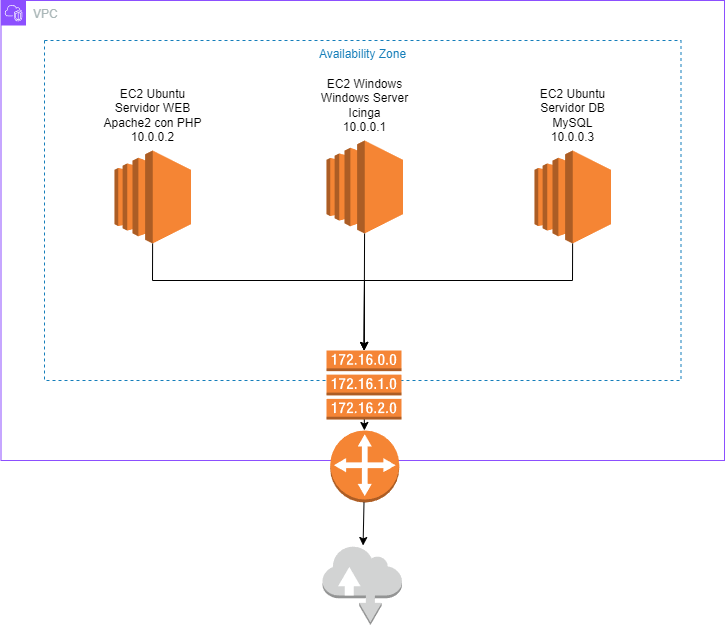

# ASO_TrabajoMonitorizacion

# 1  Las herramientas de monitorización de servidores.
       
## 1.1  Introducción general.
La monitorización de sistemas y estructuras de Tecnologías de la Información (TI) es un proceso fundamental para supervisar y analizar continuamente los componentes de una infraestructura informática, con el fin de detectar problemas y errores en tiempo real y poder resolverlos de manera efectiva. Esta práctica se lleva a cabo mediante el uso de herramientas y software especializado, que permiten recopilar, visualizar, analizar, correlacionar y alertar sobre datos de rendimiento del servidor, lo que facilita la detección y resolución efectiva de problemas. La monitorización de servidores es esencial para garantizar la disponibilidad, el rendimiento y la seguridad de los sistemas informáticos. 

La monitorización de servidores abarca varios procesos fundamentales que se llevan a cabo a través de herramientas especializadas. Estos procesos incluyen la recopilación de datos, su visualización, análisis, correlación y generación de alertas. La recopilación de datos implica la obtención de información relevante desde distintas fuentes, que luego se almacena para su posterior análisis. Una vez recopilados, estos datos se visualizan y analizan para crear información útil en forma de métricas o indicadores clave de rendimiento (KPIs). La correlación de datos permite identificar relaciones entre diferentes eventos o parámetros, mientras que las alertas se generan cuando los valores obtenidos no se encuentran entre los límites correctos o no cumplen con los umbrales establecidos

Es importante tener un plan de monitorización bien definido en el que se especifiquen los objetivos, metas y parámetros a medir (KPIs), así como los umbrales de alerta a utilizar. Una vez establecido un plan de monitorización, se pueden seleccionar e implementar las herramientas adecuadas para recopilar y analizar datos sobre el rendimiento del servidor. La elección de las herramientas de monitorización adecuadas depende del tamaño del entorno a monitorear, los recursos disponibles y las necesidades específicas

La combinación de estas herramientas y un plan de monitorización eficaz es crucial para mantener un control en tiempo real sobre los sistemas y redes, lo que permite mitigar o solucionar problemas de manera efectiva. La detección temprana de problemas a través de la monitorización puede prevenir interrupciones en el servicio, pérdida de datos o vulnerabilidades en la seguridad. Por ejemplo, la detección anticipada de un aumento inusual en el uso del disco puede permitir tomar medidas preventivas antes de que se agote el espacio en disco, evitando así posibles interrupciones en el servicio

## 1.2  Las herramientas  a estudiar
           

 # 2  La herramienta XXX
 ## 2.1  Historia
 ## 2.2  Funciones/utilidades y características. Ventajas y desventajas
	Nota: hablar de versiones gratuitas y pago (funcionalidades de pago)
 ## 2.3  Plataformas posibles donde instalar  requisitos (agentes y máquinas desde las que se monitoriza).
	Sistemas y distros con versiones necesarias.  
 ## 2.4  Requisitos tanto de agentes como de máquinas de monitoreo.
 ## 2.5  Esquema de Red (entorno). Máquinas, dirección de la red, IP’s, S.O. de las máquinas, servicios instalados. 

## 2.6  Instalación y configuración en máquinas a monitorizar.
### Instalación y Configuración de Icinga en un Servidor Windows

**Preparación del servidor:**

* **Actualice el sistema operativo:** Asegúrese de tener la última versión de Windows Server instalada.
* **Instale el paquete de .NET Framework 4.8:** Icinga requiere .NET Framework para funcionar.
* **Instale el módulo de Windows PowerShell ISE:** Se utiliza para ejecutar scripts de PowerShell para la configuración.
* **Descargue los archivos de instalación:** Obtenga la última versión de Icinga desde el sitio web oficial: https://icinga.com/get-started/download/

**Instalación de Icinga:**

1. **Ejecute el instalador:** Inicie el archivo `icinga-windows-x64.msi` y siga las instrucciones en pantalla.
2. **Elija el tipo de instalación:** Seleccione "Servidor Icinga" para una instalación completa con la interfaz web y la base de datos.
3. **Configure los componentes:** Elija los módulos de Icinga que desea instalar. Se recomienda instalar los módulos básicos como `icinga2`, `icingaweb2` e `ido-mysql`.
4. **Configure la base de datos:** Seleccione "Usar una base de datos existente" e ingrese la información de su servidor MySQL.
5. **Complete la instalación:** Siga las instrucciones en pantalla para finalizar la instalación.

**Configuración de Icinga:**

1. **Configure el archivo de configuración principal:** Abra el archivo `icinga2.conf` en un editor de texto como Notepad++.
2. **Ajuste la configuración general:** Modifique la configuración según sus necesidades, como la zona horaria, el nombre del servidor y la configuración de notificaciones.
3. **Defina los hosts y servicios a monitorizar:** Cree archivos de configuración para cada host y servicio que desea monitorizar. Utilice la sintaxis de Icinga para definir las comprobaciones y notificaciones.
4. **Importe la configuración:** Importe los archivos de configuración a Icinga usando el comando `icinga2 feature enable configimport`.
5. **Inicie el servicio Icinga:** Inicie el servicio `Icinga 2` para que la configuración surta efecto.

**Acceso a la interfaz web:**

1. Abra un navegador web e ingrese la dirección URL `https://localhost:5665/icingaweb2/`.
2. Inicie sesión con el usuario `icingaadmin` y la contraseña que estableció durante la instalación.
3. La interfaz web le permite ver el estado de sus hosts y servicios, administrar la configuración y crear nuevos monitores.

**Recursos adicionales:**

* Documentación oficial de Icinga: https://icinga.com/docs/icinga-2/latest/doc/04-configuration/
* Tutoriales de Icinga: https://www.youtube.com/watch?v=gmv66GIA0l8
* Foro de la comunidad de Icinga: https://community.icinga.com

# 3. Instalación y configuración en máquinas a monitorizar (agentes) y remotas.
 ## 3.1  Instalación y configuración en agentes 
 ## 3.2  Diseño de pruebas.  Decisión de servicios a monitorizar
 ## 3.3  Puesta en marcha (pruebas) y ejemplo de uso.

 # 4  [Otros puntos a investigar según la herramienta]

    • Instalación mediante script en las máquinas de la red a monitorizar.
    • Monitorización remota por SSH  o en consola. 
    • Monitorización usando el navegador web.Alerta a usuario 
    • Tarea programada (si procede) en cron.
    • Otros usos: proxy, etc 

 # 5  Conclusiones y problemas encontrados 
 Conclusiones tras conocer la herramienta. Indicar también problemas (y cómo se han solventado).

 # 6  OPCIONAL --- Comparativa con otras herramientas (trabajo de otro equipo)
 ## 6.1   Funciones/utilidades y características. Ventajas y desventajas
 ## 6.2   Plataformas y  requisitos.
 ## 6.3  Conclusión tras la comparativa (si lo consideras necesario)

 # 7  Bibliografía

# ANEXO. Desarrollo del proyecto con SCRUM
## I. Equipo y roles
## II. Reuniones realizadas (events)
## III. Documentos: 
- link al backlog del equipo  -- no olvidar compartir con mctripiana@iesgrancapitan.org --
- Añadir (compartir en drive, link) cualquier otro documento que sea necesario
           
           
